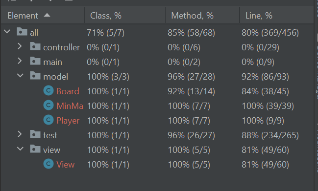

# **MiniProjekt 2** 
____
##  **Question**
### > _Which tests are important to have, important changes in the program, what was challenging in the task?"_
______

### Answer:
This Assignment was a bit of a challenge,
Creating all the Test methods was no problem because i new from the start
that my test methods was going to be re-written or tweaked when i started with the main code

The main problem i faced was when the board and depth got bigger my minmax algorithm got slower 
which led to it not completing before new code started running.
After some thinking i got the idea to implement Threads and use 
the join() method built in to the Thread class that pauses current thread
until the thread you called join on has been completed.

To summarize this assignment took longer than i thought and was also a little bit harder than i thought but was much needed
for me to really understand threads and how they work together. I also understand why red green refactor can be a huge part of a devloping process
because it gives the developer an estimation on what should be done.

